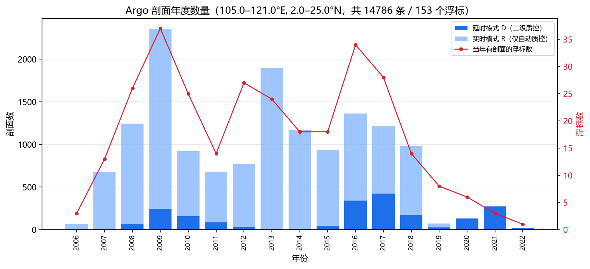
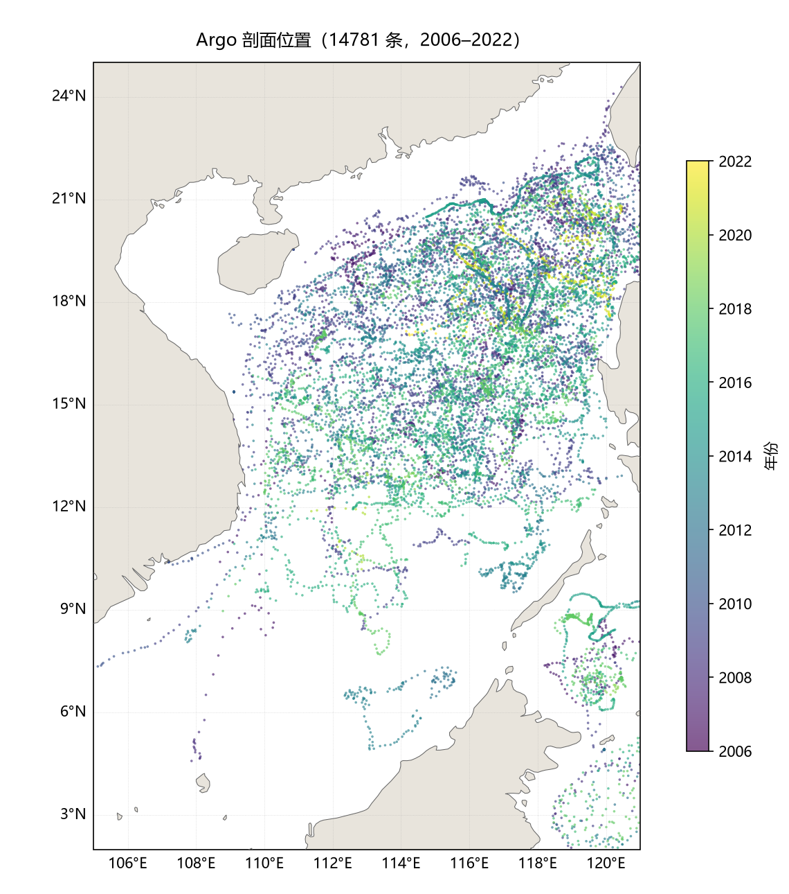
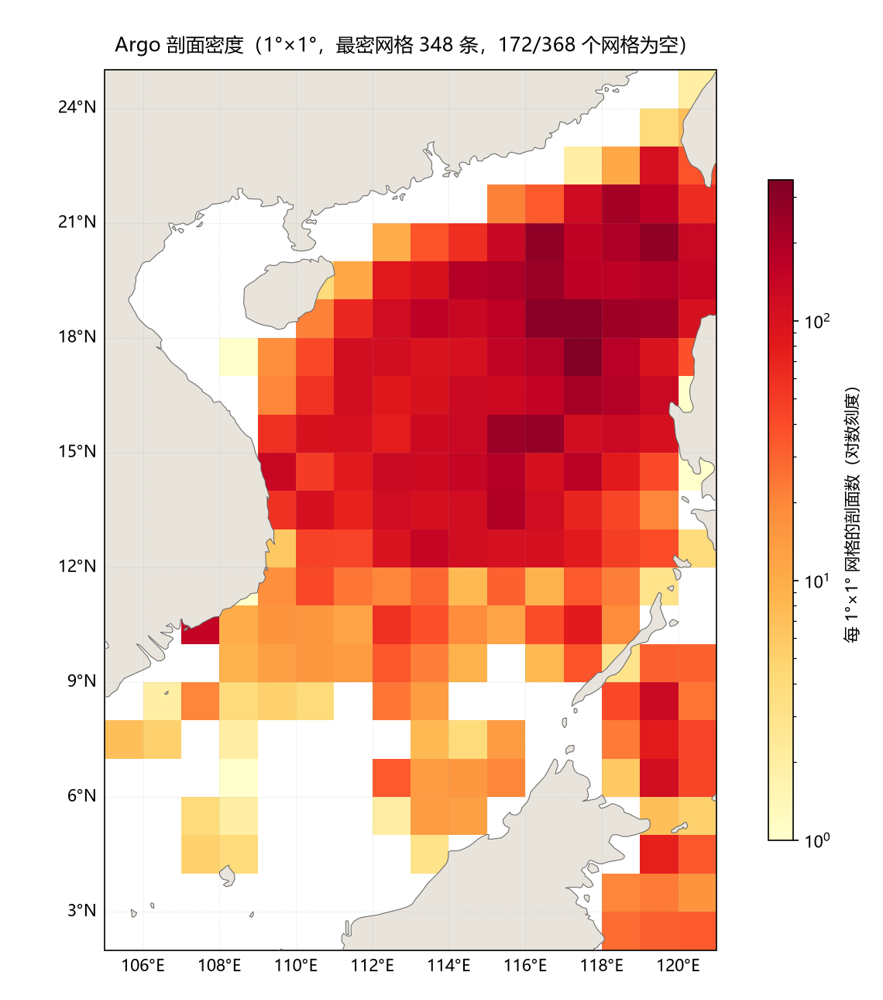

# Argo（南海）

脚本：[download_argo.py](../download_argo.py)

| 项目 | 值 |
| --- | --- |
| 数据集覆盖 | 全球 1997 至今 |
| **默认南海范围内实际跨度** | **2006-01-30 – 2022-04-26**，2022 年 4 月后无数据，见「坑」 |
| 时间分辨率 | 离散剖面，无固定间隔 |
| 脚本可用范围 | 1997 – 当前年（`--years`，上限随系统日期走） |
| 空间分辨率 | 离散剖面点，非网格 |
| 默认区域 | 南海 105–121°E, 2–25°N |
| 体积 | 18–22 KiB/剖面，默认范围全量约 290 MiB（14,786 条） |

```powershell
python F:\Code\data_download\download_argo.py -o D:\Argo -n          # 只筛选统计，不下载
python F:\Code\data_download\download_argo.py -o D:\Argo             # 下载默认南海全部剖面
python F:\Code\data_download\download_argo.py -o D:\Argo --years 2010-2020 --mode D
python F:\Code\data_download\download_argo.py -o D:\Argo --bbox 99,122,0,25
```

默认范围是南海 `105,121,2,25`（`lon0,lon1,lat0,lat1`）。`--mode D` 只要延时模式，
`--years` 支持 `2010` / `2010-2020` / `2010,2013-2015`。中断后重跑同样的命令即可，
已下好的文件按存在性跳过，不重新校验大小；要强制重下加 `--overwrite`。

退出码：`0` 全部成功，`1` 有剖面失败（清单写在 `failed.txt`，重跑只补这些），
`2` 参数错误，`130` Ctrl-C 中断。

输出目录结构：

```
D:\Argo\
  ar_index_global_prof.txt.gz   全局索引缓存，7 天内复用
  index_selected.csv            本次筛出的剖面清单
  failed.txt                    有失败时才写
  dac\<dac>\<浮标号>\profiles\*.nc
```

脚本只用标准库加 tqdm。

## 数据源

<https://data-argo.ifremer.fr/>（2026-09-07 实测），GDAC 的 Coriolis 节点。

流程是先取全局剖面索引 `ar_index_global_prof.txt.gz`（约 56 MiB，每天更新，解压后 1 GiB 级，
脚本流式读不占内存），按经纬度和年份筛出目标剖面，再逐个下 `dac/<相对路径>` 的 NetCDF。
单个剖面文件 18–22 KiB，纯 HTTP、无需注册。

## 南海到底有多少

以下是 2026-09-07 的索引在默认范围内的统计，脚本 `-n` 可随时复现。

| 项目 | 数值 |
| ---- | ---- |
| 剖面总数 | 14,786 |
| 浮标数 | 153 |
| 时间跨度 | 2006-01-30 – 2022-04-26 |
| 延时模式 D | 2,040 条（13.8%） |
| 实时模式 R | 12,746 条（86.2%） |
| 全量体积 | 约 290 MiB |
| BGC-Argo（溶解氧/叶绿素等） | 0 条 |

处理中心分布：AO（美国 AOML）12,776、HZ（自然资源部第二海洋研究所）1,895、
CS 61、JA 44、KM 10。这是数据处理中心，不等于浮标布放国。







三张图是 2026-09-07 的索引按默认范围画的，脚本本身不带绘图功能，要更新得临时写。

## 坑

- **2022 年 4 月之后没有数据。** 最后一条是浮标 2902711 在 2022-04-26、17.47°N 117.05°E 的
  剖面。同期 121°E 以东（吕宋海峡以东、台湾以东）覆盖正常，全球索引本身也是全的
  （2026 年至今 12 万余条），所以是南海确实没有活跃浮标，不是索引缺失。
  拿 Argo 验证 2023 年以后的模式或再分析结果，在这片海域没有样本。
- **86% 是实时模式。** R 文件只过了自动质控，盐度漂移没做延时校正。要做定量误差统计
  就得 `--mode D`，但样本量会掉到 2,040 条。
- **没有生化要素。** 合成剖面索引 `argo_synthetic-profile_index.txt.gz` 在这个范围内是
  0 条，溶解氧、叶绿素、硝酸盐在 Argo 体系里拿不到。
- **贴岸的高密度格点要当心。** 密度图上 107–108°E、10–11°N 那格有 146 条剖面，
  全部来自同一个浮标 2900834，看着像浮标滞留近岸反复上报，不是真的观测密集。
  近岸格点的数据要先看轨迹再用。
- **覆盖只在深水海盆。** 浮标 2000 m 的停留深度决定了北部陆架、北部湾、泰国湾基本是空的；
  另一头，默认矩形的东北角会带进吕宋海峡以东、台湾东南侧的点，要严格限制在南海海盆
  就自己收窄 `--bbox`。

## 引用与许可

Argo 数据免费开放，无使用限制，但要求致谢。数据集 DOI 为
[10.17882/42182](https://doi.org/10.17882/42182)，标准致谢语：

> These data were collected and made freely available by the International Argo Program
> and the national programs that contribute to it (https://argo.ucsd.edu,
> https://www.ocean-ops.org). The Argo Program is part of the Global Ocean Observing System.
